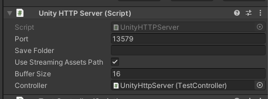
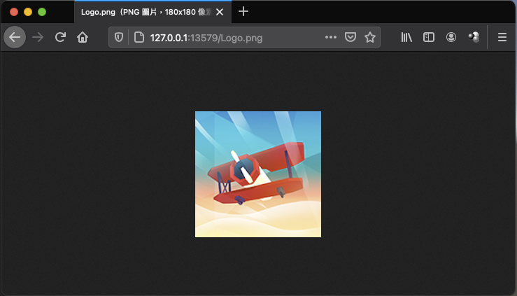
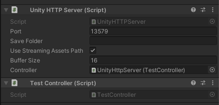
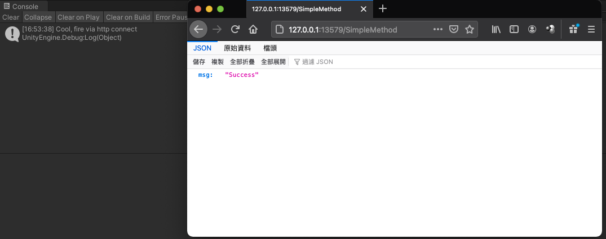
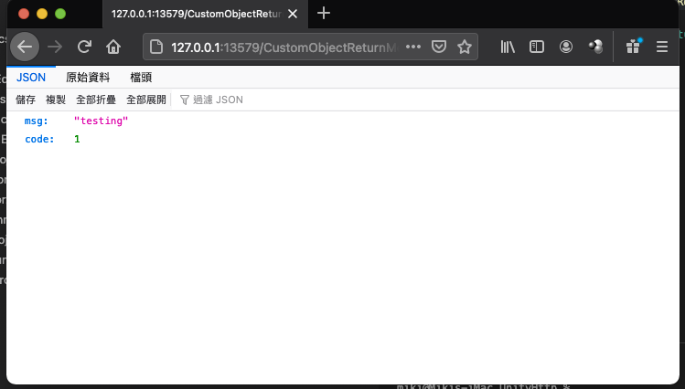
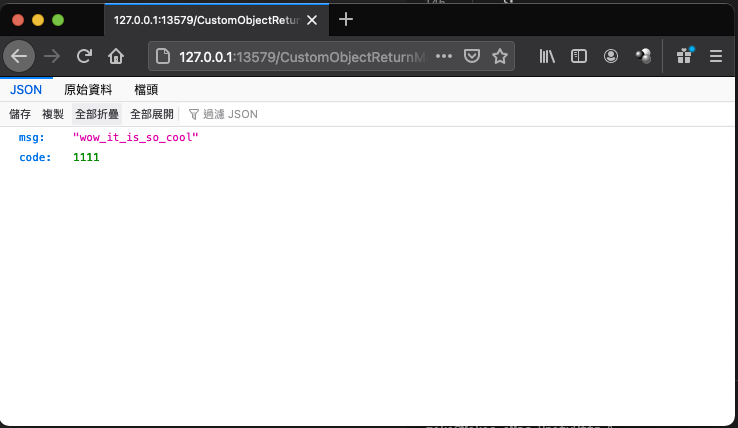
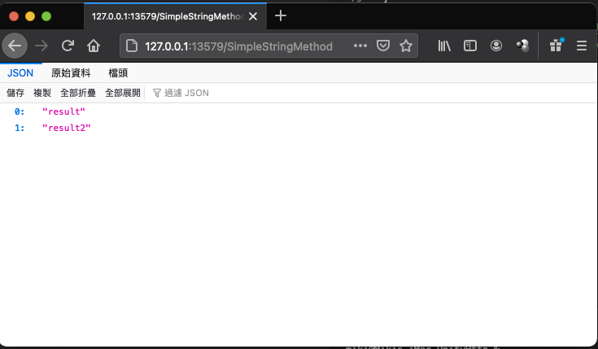
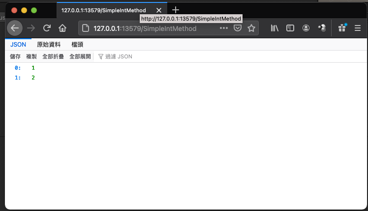

# UnityHTTPServer 
UnityHTTPServer is a simple C# http server implementation works under Unity3D.

## Feature
------
- Simple file serve via http
- Simple route WebAPI in Unity3D

## Supported Platform
------
- OSX Editor
- OSX Player (Not test yet, in theory)
- Windows Editor
- Windows Player
- others is waiting for test

## Get Start
------
Simply add a GameObject in your scene and add UnityHTTPServer component.

*Port*: the port you wish to serve the http.

*Save Folder*: the wwwroot for your files wish to serve via http.

*Use StreamingAssetsPath*: Toggle this bool will use StreamingAssetsPath to replace the Save Folder.

*Buffer Size*: The buffer for your content to serve via http.

*Controller*: The MonoBehaviour instance to run your WebAPI method.



## Serve Files
------
Just simply make sure your files is under the Save Folder.
Then enter PlayMode in Editor.

Example: (Use StreamingAssetsPath is on)


Result:



## WebAPI method
------
Create a MonoBehaviour and make sure the MonoBehaviour has an instance in scene, it is recommend to attach the MonoBehaviour on same GameObject with UnityHTTPServer.

Then make the MonoBehaviour to the reference on UnityHTTPServer's Controller field.

You can invoke a void method in target MonoBehaviour via add your method name on url. 

On the screenshot we use TestController.cs as an example.


### Void Method
------

Example:

```csharp  
// Url: http://127.0.0.1:{port}/SimpleMethod
// change {port} to the port set on your UnityHttpController component

public void SimpleMethod()
{
    Debug.Log("Cool, fire via http connect");
}
```  
Result:



### Custom Object
------

In theory, you can return any object which support by json serialize.
Example: 

```csharp  
// Url: http://127.0.0.1:{port}/SimpleStringMethod
// change {port} to the port set on your UnityHttpController component
public string[] SimpleStringMethod()
{
    return new string[]{
        "result","result2"
    };
}

// Url: http://127.0.0.1:{port}/CustomObjectReturnMethod
// change {port} to the port set on your UnityHttpController component
public ReturnResult CustomObjectReturnMethod()
{
    ReturnResult result = new ReturnResult
    {
        code = 1,
        msg = "testing"
    };
    return result;
}

public class ReturnResult
{
    public string msg;
    public int code;
}
```  
Result:



### Query parameter
------
You can also add query parmeter in your Url

Example: 

```csharp  
// Url: http://127.0.0.1:{port}/CustomObjectReturnMethodWithQuery?code=1111&msg=wow_it_is_so_cool
// change {port} to the port set on your UnityHttpController component
public ReturnResult CustomObjectReturnMethodWithQuery(int code, string msg)
{
    ReturnResult result = new ReturnResult
    {
        code = code,
        msg = msg
    };
    return result;
}

public class ReturnResult
{
    public string msg;
    public int code;
}
```  
Result:



### Array Return
------
You can invoke a method which return an array result. 

Note: The supportion of array is based on your Json Library, in case I use the LitJson library, the array return supportion will break while using Unity's JsonUtility

Add *UseLitJson* define symbol in your ProjectSetting to use LitJson in Demo project

Example:

```csharp  
// Url: http://127.0.0.1:{port}/SimpleStringMethod
// change {port} to the port set on your UnityHttpController component
public string[] SimpleStringMethod()
{
    return new string[]{
        "result","result2"
    };
}

// Url: http://127.0.0.1:{port}/SimpleIntMethod
// change {port} to the port set on your UnityHttpController component
public int[] SimpleIntMethod()
{
    return new int[]{
        1,2
    };
}
```  
Result:

SimpleStringMethod


SimpleIntMethod



## TODO
------
- Mutil controller support
- Https?
- Correct error handle (return 500 http code)
